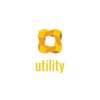

<p align="right">
    
</p>

# u7 - Universal 7 CLI

A unified command-line interface with 7 intuitive verbs for humans and AI agents.

## The Universal 7 Verbs

| Verb | Purpose | Example |
|------|---------|---------|
| `show` | Observe/Search | `u7 show ip external` |
| `make` | Create/Clone | `u7 make password 16` |
| `drop` | Delete/Kill | `u7 drop file temp.txt` |
| `convert` | Transform/Extract | `u7 convert archive to files backup.tar.gz` |
| `move` | Relocate/Rename | `u7 move file.txt to newname.txt` |
| `set` | Modify/Config | `u7 set text "old" to "new" in file.txt` |
| `run` | Execute/Control | `u7 run job "echo done" in 5s` |

## Installation

Requires [Nix](https://nixos.org/download.html) with flakes enabled.

```bash
git clone https://github.com/vitali87/utility.git
cd utility
nix develop
```

You're now in a reproducible shell with all dependencies and `u7` ready to use.

## Usage

```bash
# Get help
u7 --help
u7 show --help

# Network
u7 show ip external
u7 show ip internal
u7 show ssl google.com

# Files
u7 show files match "TODO" ./src
u7 show files modified
u7 show csv data.csv limit 10

# System
u7 show info cpu
u7 show info disk
u7 show processes top_cpu

# Create
u7 make dir myproject
u7 make password 32
u7 make archive backup.tar.gz ./src

# Transform
u7 convert archive to files backup.tar.gz
u7 convert png to jpg image.png
u7 convert json to yaml config.json

# Modify
u7 set text "foo" to "bar" in file.txt
u7 set perms 755 script.sh

# Execute
u7 run job "echo done" in 10s
u7 run background ./long-task.sh
```

## Why u7?

- **Minimal vocabulary**: 7 verbs cover all Unix operations
- **Consistent grammar**: `u7 <verb> <entity> [operator] [args]`
- **AI-friendly**: Designed for both humans and AI agents
- **Reproducible**: Nix ensures identical environments everywhere
- **Cross-platform**: Works on Linux and macOS

## Author

Vitali Avagyan: [@vitali87](https://github.com/vitali87)

## License

[](https://choosealicense.com/licenses/mit/)

## Support

If you find this project helpful:

<a href="https://www.buymeacoffee.com/vitali87" target="_blank"></a>
